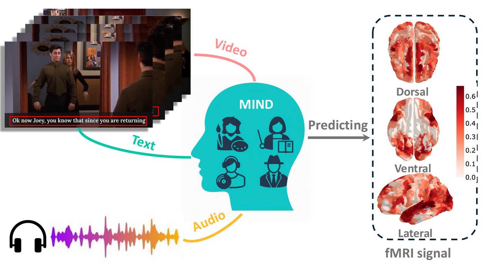

<div align="center">

# MIND: Mixture-of-Experts Integrated Decoder

### Improving Multimodal Brain Encoding Model with Dynamic Subject-Awareness Routing

**ICASSP 2026**

[Xuanhua Yin](https://github.com/xuanhuayin), [Runkai Zhao](https://scholar.google.com/citations?user=JvoODTgAAAAJ), [Weidong Cai](https://weidong-tom-cai.github.io/)

School of Computer Science, The University of Sydney

[](https://arxiv.org/abs/2510.04670)
[](#license)



</div>

## Overview

We introduce **AFIRE** (Agnostic Framework for Multimodal fMRI Response Encoding), a plug-and-play post-fusion interface, and **MIND**, a sparse Mixture-of-Experts decoder with **SADGate** (Subject-Aware Dynamic Gating) for end-to-end whole-brain fMRI prediction.

**SADGate** combines:
- **Token Router** &mdash; token-dependent softmax routing
- **Subject Prior Router** &mdash; global logit vector + per-subject bias matrix

```
Video Encoder  ─┐
Text Encoder   ─┤── Fuser ── AFIRE (projector + temporal MLP) ── MIND (SADGate + MoE) ── fMRI
Audio Encoder  ─┘                                                     ↑ Subject ID
```

## Setup

```bash
pip install -r requirements.txt
```

Dependencies: PyTorch >= 2.1, einops, x-transformers, tensorboard, tqdm.

## Data

This code assumes features have been extracted from the [Algonauts 2025](https://algonautsproject.com/) dataset and stored as `.npy` files at 2 Hz resolution.

<details>
<summary><b>Required data layout</b></summary>

```
data_root/
  pipeline_TRIBE/features/{video,text,audio}_2hz/sub-01/{episode}.npy
  pipeline_IMAGEBIND/features/{video,text,audio}_2hz/sub-01/{episode}.npy
  pipeline_QWEN/features/multimodal_2hz/sub-01/{episode}.npy
  fmri_data/sub-01/{episode}.npy
  fmri_data/sub2/{episode}.npy
  fmri_data/sub3/{episode}.npy
  fmri_data/sub5/{episode}.npy
```

Feature shapes (per episode):
| Backbone | Shape | Note |
|---|---|---|
| TRIBE | video `[T, 40, 1408]`, text `[T, 28, 3072]`, audio `[T, 24, 1024]` | Multi-layer |
| ImageBind | `[T, 1, 1024]` per modality | Single layer |
| Qwen2.5-Omni | `[T, D]` | Fused multimodal |

</details>

## Training

```bash
# Set DATA_ROOT to where your features and fMRI data live
export DATA_ROOT=/path/to/data_root

# Train with ImageBind backbone
bash scripts/train_imagebind.sh

# Train with TRIBE backbone
bash scripts/train_tribe.sh

# Train with Qwen2.5-Omni backbone
bash scripts/train_qwen.sh
```

All scripts support extra arguments (appended at the end), e.g.:

```bash
bash scripts/train_imagebind.sh --epochs 50 --lr 5e-4
```

<details>
<summary><b>Key arguments</b></summary>

| Argument | Default | Description |
|---|---|---|
| `--moe_num_experts` | 4 | Number of MoE experts (6 for ImageBind/Qwen, 8 for TRIBE) |
| `--moe_top_k` | 2 | Sparse Top-K selection |
| `--moe_dropout` | 0.1 | Dropout in expert MLPs |
| `--moe_combine_mode` | `router_x_learned` | SADGate mode |
| `--moe_subject_expert_bias` | flag | Enable subject-expert bias (SADGate) |
| `--subject_embedding` | flag | Add subject embedding to tokens |
| `--layers` | `last1` | Layer selection (e.g., `last4`, `0.6,0.8,1.0`) |
| `--window_tr` | 100 | Window length in TRs |
| `--stride_tr` | 50 | Stride in TRs |

</details>

## Results

Mean validation performance across all episodes (S1&ndash;S5):

| Backbone | Decoder | *r* | *rho* | *R*<sup>2</sup> | ISG |
|:---|:---|:---:|:---:|:---:|:---:|
| TRIBE | Baseline | 0.256 | 0.240 | 0.081 | 0.187 |
| TRIBE | **MIND** | **0.273** | **0.259** | **0.092** | **0.241** |
| ImageBind | Baseline | 0.131 | 0.121 | 0.026 | 0.097 |
| ImageBind | **MIND** | **0.221** | **0.203** | **0.064** | **0.162** |
| Qwen2.5-Omni | Baseline | 0.125 | 0.130 | 0.025 | 0.103 |
| Qwen2.5-Omni | **MIND** | **0.220** | **0.205** | **0.059** | **0.162** |

## Citation

If you find this work useful, please cite:

```bibtex
@inproceedings{yin2026mind,
  title={Improving Multimodal Brain Encoding Model with Dynamic Subject-Awareness Routing},
  author={Yin, Xuanhua and Zhao, Runkai and Cai, Weidong},
  booktitle={IEEE International Conference on Acoustics, Speech and Signal Processing (ICASSP)},
  year={2026}
}
```

## License

This project is for research purposes.
